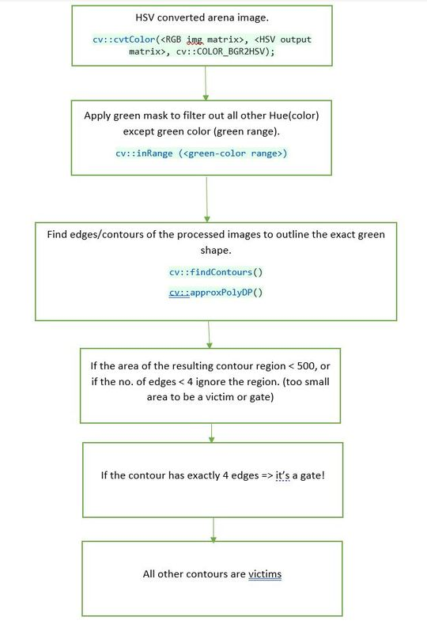
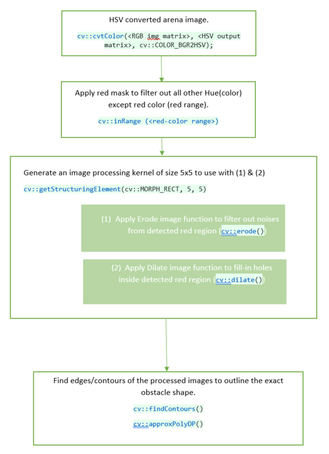
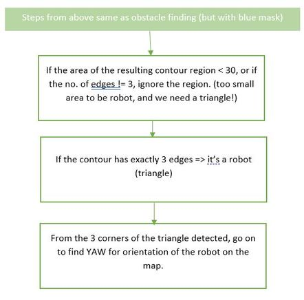

# Laboratory of Applied Robotics Student Interface

## Loading and saving image 

```
void loadImage(cv::Mat& img_out, const std::string& config_folder)
```
```
void genericImageListener(const cv::Mat& img_in, std::string topic, const std::string& config_folder)
```

## Intrinsic calibration 

## Extrinsic calibration 

## Obstracle-victim-gate-robot detection / Areana map generation

  > Detecting green victims and gate



  > Detecting red obstracles



  > Detecting blue robot, and its 'yaw'



## Victim rank detection ( digit recognition )

### Using template matching

### Tesseract-OCR

